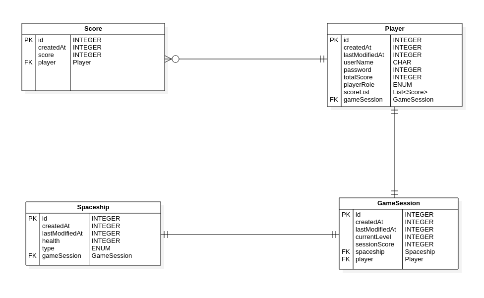

# Group18/CoronaKiller - Backend Development

This module consists of the implementations for our server-side development.

# Getting Started

## Build and run:

!!!!!!!!!!!!!!!!!* On a Docker Container: YAVUZZZZZZZZ
```
mvn clean package
sudo docker build -t potential-playlist .
sudo docker run -e"SPRING_PROFILES_ACTIVE=dev" --network="host" -d --rm --name potential-playlist potential-playlist
```

* On host machine:
```
mvn clean install
java -jar -Dspring.profiles.active=prod target/CoronaKiller-Backend-1.0-SNAPSHOT.jar
```

## More About the Application
Simply put, this application is a backend that aims to serve services to multiple _potential-playlist_ users as a song and playlist platform (Just as Spotify's backend :blush:) 
from where users can create and maintain their favourite playlists and songs of their favourite albums and artists.

Currently there are 5 main models in various relations with each other in the app, which are Playlists, Songs, Albums, Artists and Users 
(Pretty much the users that application authenticates and authorizes). Below ER diagram illustrates the relations of models with each other (attributes except primary keys are excluded due to brevity):

## DB Design
In this project, there are 4 different type of entities.
* Player object is responsible for holding the player and it's attributes,
* Score object is responsible for keeping the score data for each player as
well as it's creation time data,
* GameSession entity holds the necessary level-score-spaceship information 
along with the player knowledge, 
* Also, spaceship entity holds necessary attributes in it.   

Relationships between entities are listed as:
* One player can have multiple scores so there is one-to-many relationship exists,
* One player can have one gameSession so there is one-to-one relationship exists,
* lastly, one gameSession has one spaceShip so there is one-to-one relationship exists.
  


### Testing
#### Unit Tests
!!!!!!!!!!!!!!!!ALPER!!!!!!!!!!!!!!!!!!!
#### Postman
You can find the corresponding postman collection `CoronaKiller-Backend.postman_collection.json` under the main folder, which has a request collection that covers pretty much all possible requests that can be applied to the API endpoints. Both parent collection and requests have their descriptions. For manual testing of the endpoints using this collection, there is a guide in the collection description.

### Documentation
For API documentation `Swagger2` and javadoc has been used in various parts of the project. One can check `localhost:8080/swagger-ui.html` for swagger Documentation page (it can be accessed anonymously, it will not require Authentication).

## Authors
###### Group 18
* Yavuz Selim YEŞİLYURT - 2259166
* Alper KOCAMAN - 2169589
